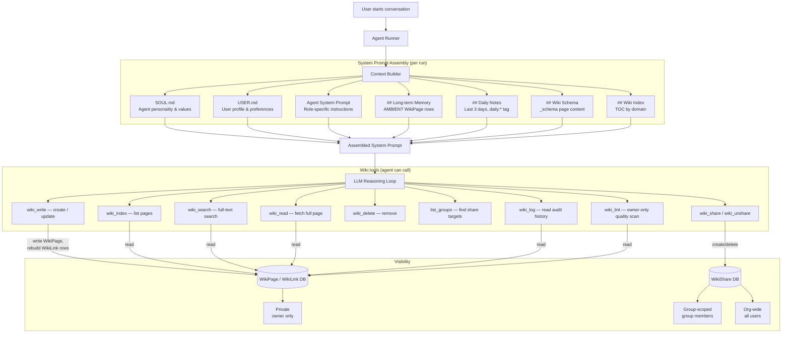
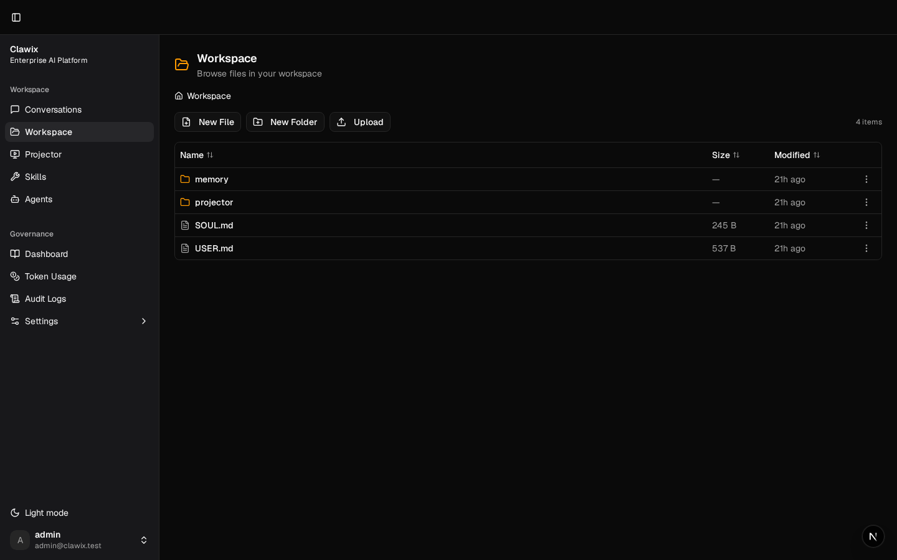
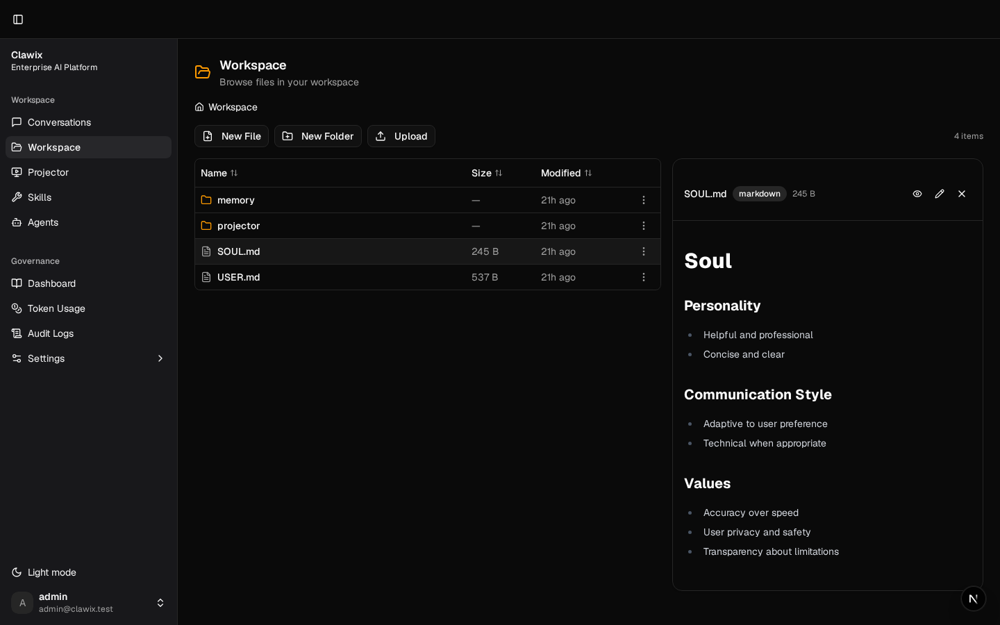
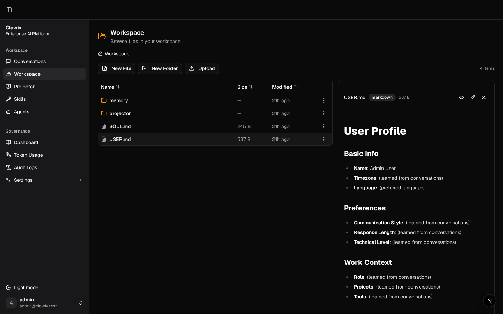
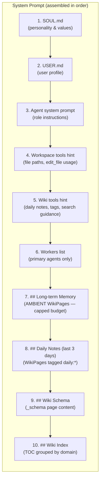
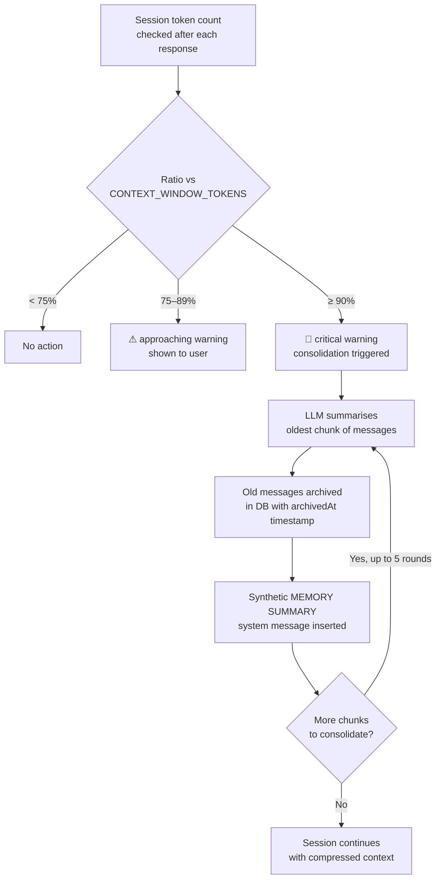

# Memory — Guide

> **Migration note:** Clawix's long-term memory is now backed by a per-user **wiki** (`WikiPage` / `WikiLink` / `WikiShare`) instead of the old `MemoryItem` / `MemoryShare` tables. The legacy `save_memory` / `search_memory` / `share_memory` tools have been replaced by the `wiki_*` toolset described below. The `/memory` page now 308-redirects to `/wiki`. User-profile facts continue to live in the file-based `/workspace/USER.md`, **not** in the wiki — keeping two sources of truth would cause drift.

> **Background.** The design follows the **"LLM Wiki"** pattern proposed by Andrej Karpathy ([gist](https://gist.github.com/karpathy/442a6bf555914893e9891c11519de94f)): an LLM-maintained markdown knowledge base with three layers — raw sources, the wiki itself, and a schema document — built around `ingest` / `query` / `lint` operations. Clawix's `WikiPage`, `_schema` page, `[[slug]]` cross-links, and `wiki_write` / `wiki_search` / `wiki_lint` tools are the concrete realisation of that pattern.

## What is Memory?

In Clawix, **memory** is the collective term for all persistent context that is loaded into an agent's system prompt at the start of every run. It is what gives agents continuity — the ability to remember who you are, what you have worked on, what you have learned, and what you have decided — across separate conversations.

Memory is **not** a single monolithic file. It is a layered system with four distinct components, each serving a different purpose:

| Layer                        | Source                                        | What it contains                                              | Who controls it               |
| ---------------------------- | --------------------------------------------- | ------------------------------------------------------------- | ----------------------------- |
| **Soul** (`SOUL.md`)         | Static file in workspace                      | Agent personality, communication style, values                | Admin / user (edit the file)  |
| **User Profile** (`USER.md`) | Static file in workspace                      | User name, preferences, work context, special instructions    | Agent learns + user edits     |
| **Long-term Memory** (Wiki)  | DB: `WikiPage` rows with `scope='AMBIENT'`    | Durable facts, decisions, standards, current-project state    | Agent writes via `wiki_write` |
| **Daily Notes**              | DB: `WikiPage` rows tagged `daily:YYYY-MM-DD` | Short-term activity journal; what happened in the last 3 days | Agent writes via `wiki_write` |

All four layers are injected into the agent's **system prompt** at the start of each run, before any conversation history. This means the agent always "wakes up" with full context — without the user needing to repeat themselves.

A fifth element, the **Wiki Schema** (`_schema` page, see [`/wiki/schema`](#wiki-schema)), is also auto-injected: it tells the agent how _this user_ wants their wiki organized (naming conventions, when to create pages, etc.).

---

## The Mental Model — Why a wiki, not a memory blob?

If you've worked with other AI agent platforms, "memory" probably meant one of two things. Clawix does neither — it follows the **LLM Wiki** pattern instead. Understanding the difference is the key to understanding why the rest of this doc looks the way it does.

### The two conventional approaches

1. **Append-everything log.** The agent appends raw facts ("user prefers TS strict mode", "we use Zod for validation", …) to a flat list. Over months the list grows large, accumulates contradictions, and the model has to re-read it every turn. There is no structure, no deduplication, no schema.
2. **RAG over raw sources.** Every query, an embedding model retrieves the _k_ most relevant chunks from a static document store. The store grows, but it is **never digested** — each query reads raw, unstructured text. Conflicting or stale chunks are returned next to fresh ones; the model is left to reconcile them on every call.

### Clawix's approach: the LLM Wiki

Clawix implements the **LLM Wiki** pattern proposed by Andrej Karpathy ([gist](https://gist.github.com/karpathy/442a6bf555914893e9891c11519de94f)). The agent doesn't accumulate raw facts and it doesn't search raw documents — it **maintains a living wiki of distilled, cross-linked knowledge** about you, the work, and the project.

The pattern has three layers:

| Layer           | What it is                                                                                                                                               | Who writes it                                            |
| --------------- | -------------------------------------------------------------------------------------------------------------------------------------------------------- | -------------------------------------------------------- |
| **Raw sources** | Conversations, files, agent runs — the inputs the agent reads.                                                                                           | The user / external systems (immutable to the agent).    |
| **The wiki**    | A structured, interlinked set of markdown pages (`WikiPage` rows). One page = one coherent topic.                                                        | The agent, via `wiki_write` (and the user, via `/wiki`). |
| **The schema**  | A single `_schema` page that tells the agent _how to organize this user's wiki_ — naming conventions, when to create vs append, what counts as a domain. | The user, at `/wiki/schema`.                             |

…maintained through three operations, mirrored exactly in the agent's toolset:

- **Ingest** (`wiki_write`) — when something new is learned, the agent reads it, decides where it belongs, and either appends to an existing page or creates a new one, linking related pages with `[[slug]]` markers.
- **Query** (`wiki_index` / `wiki_search` / `wiki_read`) — when answering a question, the agent navigates _its own distilled wiki_ first. Pages that proved valuable get refined further; ones that didn't get pruned.
- **Lint** (`wiki_lint`) — periodically, the agent or user scans for contradictions, stale claims, orphan pages, missing `domain:*` tags, and broken `[[slug]]` links.

> _"The tedious part of maintaining a knowledge base is not the reading or the thinking — it's the bookkeeping."_ The LLM does the bookkeeping; the user curates sources and edits the schema.

### Why it matters

| Conventional memory                                   | Clawix's wiki                                                                      |
| ----------------------------------------------------- | ---------------------------------------------------------------------------------- |
| Flat list / chat-history blob; grows unboundedly      | Structured pages; each topic gets its own home                                     |
| RAG returns raw chunks — including contradictions     | The agent has already reconciled contradictions on ingest                          |
| No schema — agent decides structure on the fly        | `_schema` page governs structure → consistent over months                          |
| Linking and dedup happen at retrieval time (or never) | `[[slug]]` links + `WikiLink` rows + `wiki_lint` keep the graph clean continuously |
| Hard to inspect or correct manually                   | It's just markdown — open `/wiki` and edit                                         |
| Memory and identity tangled in one blob               | Identity (`/workspace/USER.md`) and knowledge (wiki) are separate sources of truth |

The rest of this guide describes the concrete pieces: what gets injected into every prompt, what each tool does, and how visibility, sharing, and limits work.

---

## Why Use Memory?

Without memory, every conversation with an agent starts from scratch. The agent forgets your name, your preferences, what you decided last week, and what it already tried. With memory:

- **No repetition** — You don't re-explain your stack, style preferences, or ongoing projects every session.
- **Compounding value** — The agent accumulates wiki pages over time. The longer you work together, the richer and more navigable the knowledge base becomes.
- **Continuity across agents** — When pages are shared to a group or the org, sub-agents and other users can read the same knowledge base.
- **Self-improving prompts** — The agent updates `USER.md` and writes/updates wiki pages as it learns, keeping its own context current.
- **Autonomous journaling** — Daily notes (`daily:YYYY-MM-DD` tag) give you and the agent a searchable activity log without manual effort.
- **Knowledge sharing** — Decisions, standards, and discoveries can be promoted from private wiki pages to group or org-wide pages with a single `wiki_share` call.

---

## Public vs Private Memory

Clawix implements a **three-tier visibility model** for wiki pages. The tier is determined by whether one or more `WikiShare` records exist for the page and what their `targetType` is.

```
┌─────────────────────────────────────────────────────────────────────┐
│                         WIKI VISIBILITY                             │
│                                                                     │
│  Private (default)       Group-scoped         Org-wide              │
│  ┌─────────────┐         ┌─────────────┐      ┌─────────────┐       │
│  │OwnerID only │         │ Group A     │      │ All users   │       │
│  │             │  share  │ members     │share │ in the org  │       │
│  │  WikiPage   │ ──────► │             │────► │             │       │
│  │  (no share) │         │ WikiShare   │      │ WikiShare   │       │
│  │             │         │ type=GROUP  │      │ type=ORG    │       │
│  └─────────────┘         └─────────────┘      └─────────────┘       │
│                                                                     │
│  Reversible: each share can be revoked individually                 │
└─────────────────────────────────────────────────────────────────────┘
```

### Private wiki pages

A page with no associated `WikiShare` record. Only the owning user (and their agents) can read it. **Default for every newly created page.**

**Use for:** Personal preferences, private notes, individual coding standards, personal API references, draft ideas not ready to share.

### Group-scoped pages

A page shared to a named **Group** (`WikiShare.targetType = 'GROUP'`). All members of that group can read it via `wiki_index` / `wiki_search` / `wiki_read`. Only the owner (or a group OWNER) can revoke the share.

**Use for:** Team decisions, shared coding conventions, project knowledge, shared prompt templates, collaborative research findings.

### Org-wide pages

A page shared to the entire organisation (`WikiShare.targetType = 'ORG'`, no `groupId`). Every user in the deployment can read it.

**Use for:** Company-wide standards, approved tool lists, product descriptions, security policies, on-boarding information for new agents.

### Visibility resolution

When `wiki_index` / `wiki_search` / `wiki_read` runs, it queries all three tiers simultaneously using this logic:

```
Visible = (owned by user)
        ∪ (shared to any group the user is a member of)
        ∪ (shared to org)
```

The `isOwned` flag in tool results tells the agent whether it owns the page (and thus can share, update, or delete it).

---

## Memory Architecture — Full Flow



---

## The Workspace Files

Navigate to **Workspace** in the left sidebar (path: `/workspace`).



The workspace root contains three items relevant to memory:

| Item         | Type   | Purpose                                                           |
| ------------ | ------ | ----------------------------------------------------------------- |
| `SOUL.md`    | File   | Agent personality bootstrap — injected before every system prompt |
| `USER.md`    | File   | User profile bootstrap — injected before every system prompt      |
| `projector/` | Folder | UI templates (unrelated to memory)                                |

> The legacy `memory/MEMORY.md` file is no longer the long-term memory store — those facts now live as individual `WikiPage` rows. (Session-level context compression may still write a `memory/MEMORY.md` artifact inside an agent's runtime container, but it is an internal snapshot of recent activity, not the durable knowledge layer.)

### SOUL.md — Agent Personality



`SOUL.md` defines the agent's **character**. It is injected verbatim at the top of every system prompt. The default template sets personality, communication style, and values — but you can edit it to shape the agent's behaviour for your organisation.

**Default sections:**

- **Personality** — e.g., "Helpful and professional", "Concise and clear"
- **Communication Style** — e.g., "Adaptive to user preference", "Technical when appropriate"
- **Values** — e.g., "Accuracy over speed", "User privacy and safety"

Editing `SOUL.md` is the primary way to customise an agent's persona without touching the system prompt in the agent definition.

### USER.md — User Profile



`USER.md` is the user's **profile document**. It is templated with the user's name at workspace creation and is then progressively enriched by the agent as it learns preferences from conversation.

**Default sections:**

- **Basic Info** — Name, timezone, preferred language
- **Preferences** — Communication style, response length, technical level
- **Work Context** — Role, ongoing projects, tools used
- **Special Instructions** — User-specific overrides the agent should always follow

The agent can update `USER.md` directly using the `edit_file` tool when it learns something new and persistent about the user.

> **Do NOT** mirror user-profile facts into wiki pages. The `wiki_write` tool actively rejects this duplication — `/workspace/USER.md` is the single source of truth for who the user is. Wiki pages capture _what is true about the work_, not _who the user is_.

---

## The Wiki — Long-term Memory at `/wiki`

The wiki is browsable in the dashboard at **`/wiki`** (under **Workspace** in the sidebar; the older **`/memory`** path 308-redirects there). It shows three things in the left rail:

- **Search** — free-text input that drives `wiki_search`.
- **📚 Wiki Schema** — direct link to `/wiki/schema`, the dedicated editor for the `_schema` page (see below).
- **Page list** — toggles between _Visible to me_ and _Mine_, plus a button to create a new page or a new daily note.

Each page has: `title`, `slug` (auto-derived), `summary`, markdown `content`, `tags`, `scope`, and an `ownerId`. Pages are linked together with `[[slug]]` markers in the content; those are parsed into `WikiLink` rows and exposed as **backlinks** in the page view.

### Page scope: AMBIENT vs ARCHIVED

Every wiki page has a `scope`:

| Scope        | Behaviour                                                                                                     |
| ------------ | ------------------------------------------------------------------------------------------------------------- |
| **AMBIENT**  | Auto-injected into the system prompt under `## Long-term Memory`. Use sparingly — there is a hard cap.        |
| **ARCHIVED** | (Default) Retrieved on demand via `wiki_index` / `wiki_search` / `wiki_read`. Doesn't consume context budget. |

The ambient cap is enforced per-policy (`Policy.maxAmbientPages`, default `5`). Promotion to AMBIENT is atomic — if you are already at cap, the write fails with `WIKI_AMBIENT_FULL` plus a list of the current AMBIENT pages so the agent can decide what to demote.

### Wiki Schema (`_schema`) — your wiki's user guide <a id="wiki-schema"></a>

Every user has exactly one **`_schema`** page (slug reserved, tagged `kind:schema`, always `scope='AMBIENT'`). It is bootstrapped from a template on first wiki use and is the only page the agent reads to understand _how this user wants the wiki organized_: when to create new pages vs append, naming conventions, when to share, etc.

- Edited at **`/wiki/schema`** — a dedicated split-pane editor (markdown source + live preview).
- The generic `wiki_write` tool rejects edits to `_schema`; only the dedicated `PATCH /wiki/schema` endpoint can update it.
- Restricted to developer/admin role at the controller level.

The `_schema` page is a singleton meta-page, not a content page — that is why it has its own UI and API surface rather than being edited inline alongside regular pages.

### Tag conventions

Tags are normalized to lowercase on write and follow three rules:

| Tag form                                 | Purpose                                                              | Constraints                                                                              |
| ---------------------------------------- | -------------------------------------------------------------------- | ---------------------------------------------------------------------------------------- |
| `domain:<x>`                             | Primary classifier (e.g. `domain:hr`, `domain:engineering`).         | Exactly **one** required when any non-daily tag is present. Exempt for pure daily notes. |
| `daily:YYYY-MM-DD`                       | Marks an activity-journal entry. Auto-pulled into _Recent Activity_. | Exempt from the `domain:` requirement.                                                   |
| `kind:schema`                            | Reserved — used only on the `_schema` page.                          | Do not set manually.                                                                     |
| Free-form (e.g. `tooling`, `validation`) | Secondary classifier; combine with `domain:*`.                       | Must coexist with a `domain:*` tag.                                                      |

---

## Context Injection Order

Every agent run assembles the system prompt in this exact order:



> **Sub-agents** receive a simplified prompt: only the agent system prompt (sections 3–5). They do not receive `SOUL.md`, `USER.md`, or wiki sections — their context is intentionally minimal and task-focused.

The renderer for sections 7–10 lives in `packages/api/src/engine/wiki/render-wiki-context.ts`; each section is truncated independently to its token budget so a runaway page can't starve the others.

---

## Memory Tools

Agents interact with the long-term memory layer using the `wiki_*` toolset plus `list_groups`. These tools are available to primary agents. (Sub-agents receive a minimal prompt and do not get the wiki toolset by default.)

| Tool           | Purpose                                                                                            |
| -------------- | -------------------------------------------------------------------------------------------------- |
| `wiki_index`   | Get the table of contents (title + summary + id) for every visible page. **Start here.**           |
| `wiki_search`  | Full-text hybrid search (`tsvector` + `pg_trgm`) when the index doesn't surface what you need.     |
| `wiki_read`    | Fetch one page's full content by id or slug (plus backlinks).                                      |
| `wiki_write`   | Create a new page, or update one by passing `pageId`. Rebuilds `[[slug]]` backlinks every write.   |
| `wiki_delete`  | Remove an owned page (also clears its shares and incoming links).                                  |
| `wiki_share`   | Promote an owned page to a group or org-wide.                                                      |
| `wiki_unshare` | Revoke a single share row.                                                                         |
| `list_groups`  | Discover share targets — returns the user's groups plus a synthetic `org` entry.                   |
| `wiki_log`     | Read recent audit entries for the user's wiki activity (`wiki.create`, `wiki.update`, …).          |
| `wiki_lint`    | Owner-only quality scan: duplicate slugs, orphan pages, missing `domain:*` tag, stale claims, etc. |

### `wiki_write` — Create or update a page

```
Input:
  pageId   (optional)  — if provided, update; otherwise create new
  title    (required)  — page title; slug derived from this
  summary  (optional)  — one-liner shown in the index; ≤200 chars (required for new pages)
  content  (required)  — markdown body, ≤10 000 chars; use [[slug]] to link other pages
  tags     (optional)  — ≤20 tags, each ≤50 chars; exactly one `domain:*` when non-daily tags present
  scope    (optional)  — 'AMBIENT' | 'ARCHIVED' (default 'ARCHIVED')
```

**Examples the agent might call:**

```
wiki_write(
  title    = "Validation conventions",
  summary  = "All inputs validated with Zod; no manual checks",
  content  = "We use [[zod]] for every external input. See [[auth]] for an example.",
  tags     = ["domain:engineering", "validation"]
)

wiki_write(
  title    = "Daily — 2026-05-19",
  summary  = "Daily note",
  content  = "Wrapped the wiki migration; legacy /memory now 308-redirects.",
  tags     = ["daily:2026-05-19"]
)

wiki_write(
  pageId   = "wpg_abc123",
  title    = "Validation conventions",
  content  = "...updated body with new sections...",
  scope    = "AMBIENT"
)
```

> **Daily notes convention:** Tag with `daily:YYYY-MM-DD` to create activity-journal entries. These are automatically included in the last-3-days context injection and are exempt from the `domain:*` rule.

> **Ambient cap:** Promoting a page to `AMBIENT` is rejected with `WIKI_AMBIENT_FULL` once `Policy.maxAmbientPages` is reached. The error body includes the current ambient list so the agent can demote an older page first.

### `wiki_index` — Discover pages

Returns a slim list (id, slug, title, summary, tags, scope, `isOwned`, `updatedAt`) of every page visible to the user. Filterable by `tags`, `scope`, and `ownership` (`mine` | `visible`). Limit defaults to 50, max 200.

```
wiki_index(tags = ["domain:engineering"], limit = 20)
wiki_index(scope = "AMBIENT")
wiki_index(ownership = "mine")
```

### `wiki_search` — Full-text search

Hybrid `tsvector` + `pg_trgm` query with snippet highlighting. Returns up to 30 hits (default 10). The result includes a `score` and a `snippet` so the agent can decide which pages to `wiki_read` in full.

```
wiki_search(query = "validation Zod")
wiki_search(query = "auth", tags = ["domain:engineering"], limit = 5)
wiki_search(query = "deploy", ownership = "mine")
```

### `wiki_share` / `wiki_unshare` — Visibility control

```
wiki_share(pageId = "wpg_abc123", targetType = "group", groupId = "grp_eng")
wiki_share(pageId = "wpg_abc123", targetType = "org")
wiki_unshare(shareId = "wsh_xyz789")
```

`wiki_share` is **idempotent** — calling it again with the same target returns the existing share. Use `list_groups()` first to resolve valid `groupId` values.

**Example workflow — promoting a coding standard to the team:**

```
1. wiki_write(title="Validation conventions", content="...", tags=["domain:engineering", "validation"])
   → returns pageId = "wpg_abc123"

2. list_groups()
   → returns [{ groupId: "grp_eng", name: "Engineering", type: "group", role: "MEMBER" }]

3. wiki_share(pageId="wpg_abc123", targetType="group", groupId="grp_eng")
   → "Engineering" team members can now wiki_search / wiki_read this page
```

### `wiki_lint` — Owner-only quality scan

Available when `Policy.wikiLintEnabled` is true (default). Surfaces:

- **duplicate-slugs** — multiple pages sharing the same slug
- **orphan** — `ARCHIVED` pages with no inbound links and no recent activity
- **missing-domain** — pages with non-daily tags but no `domain:*` tag
- **stale-claims** — pages that haven't been touched in a long time but claim current state
- **broken-links** — `[[slug]]` markers that point to a non-existent page

Returns up to 100 findings; the agent (or user) decides whether to fix or dismiss.

---

## Session Context Compression (Automatic)

Session-level context compression is a separate, lower-level mechanism from the long-term wiki. When a single conversation grows large enough to approach the **context window limit** (default: 65 536 tokens), Clawix automatically runs **session memory consolidation**: an LLM call summarises the oldest chunk of messages into a compact synthetic system message so the live session can continue without truncation losing meaning.



**Key facts:**

- Performed by a separate LLM call (`CONSOLIDATION_PROVIDER` / `CONSOLIDATION_MODEL`, default `openai` / `gpt-4o-mini`).
- Up to **5 consolidation rounds** per session.
- Archived messages remain in the database — they are soft-deleted, not erased.
- Consolidation is **session-scoped**. It does **not** create wiki pages on its own — durable knowledge is still up to the agent to write via `wiki_write`.

---

## Public vs Private — Decision Guide

```mermaid
flowchart TD
    A[I want the agent to remember this] --> B{Who needs to see it?}

    B -- "Only me" --> C[wiki_write\nscope='ARCHIVED' (default)\nor 'AMBIENT' if always-on]

    B -- "My team" --> D[wiki_write → list_groups\n→ wiki_share targetType='group']

    B -- "Everyone in the org" --> E[wiki_write\n→ wiki_share targetType='org']

    C --> F{Is it a daily note?}
    F -- "Yes — activity log" --> G["Tag: daily:YYYY-MM-DD\nAppears in Daily Notes\n(last 3 days)"]
    F -- "No — durable knowledge" --> H["Tag: domain:<area> + free-form\nIndexed in Wiki Index\nReachable via [[slug]]"]

    D --> I[Group members can\nwiki_search / wiki_read it\nisOwned = false in results]
    E --> J[All users can\nwiki_search / wiki_read it\nisOwned = false in results]
```

---

## Workspace Structure Reference

```
workspace/
├── SOUL.md                  ← Agent personality (injected into every system prompt)
├── USER.md                  ← User profile (injected into every system prompt)
├── projector/               ← UI output templates (unrelated to memory)
│   ├── color-palette/
│   └── image-sharpener/
└── [your project files]     ← Any files the agent creates during work
```

**Host path:** `{WORKSPACE_BASE_PATH}/users/{userId}/workspace/`

Default `WORKSPACE_BASE_PATH`: `./data`

Long-term memory pages do **not** live in this folder — they are `WikiPage` rows in Postgres and are browsed at `/wiki`.

---

## Wiki Limits Reference

| Limit                       | Value               | Source                         |
| --------------------------- | ------------------- | ------------------------------ |
| Max AMBIENT pages per user  | 5 (policy default)  | `Policy.maxAmbientPages`       |
| Max content length per page | 10 000 chars        | `wiki_write` input validation  |
| Max summary length          | 200 chars           | `wiki_write` input validation  |
| Max tags per page           | 20                  | `wiki_write` input validation  |
| Max tag length              | 50 chars            | `wiki_write` input validation  |
| `wiki_index` page limit     | Default 50, max 200 | `wiki_index` input validation  |
| `wiki_search` result limit  | Default 10, max 30  | `wiki_search` input validation |
| `wiki_lint` finding cap     | 100                 | `wiki_lint` input validation   |
| Context window threshold    | 65 536 tokens       | `CONTEXT_WINDOW_TOKENS`        |
| Max consolidation rounds    | 5                   | session-consolidation service  |

Per-section token budgets for the context injection (Long-term Memory / Daily Notes / Wiki Schema / Wiki Index) live alongside the renderer in `engine/wiki/render-wiki-context.ts` and are independently truncated.

---

## Editing Manually

### Editing wiki pages

Open **`/wiki`** in the dashboard. Select a page on the left to load its editor on the right — change title, summary, content, tags, scope, and group/org sharing. Use **`/wiki/schema`** to edit the `_schema` page (split-pane source + preview).

Changes take effect on the **next agent run** — in-flight sessions are not affected.

### Editing workspace files

`SOUL.md` and `USER.md` can be viewed and edited directly in the **Workspace** file browser.

1. Go to **Workspace** in the sidebar.
2. Click a file row to open the preview panel (right side).
3. Click the **pencil (edit)** icon in the preview header to open the inline editor.
4. Make changes and save.

> **Caution:** `USER.md` is also kept up to date by the agent itself via the `edit_file` tool. Manual edits and agent edits both work; the agent will not overwrite verbatim sections unless it has a reason to update them.

---

## Troubleshooting

| Symptom                                            | Likely cause                                               | Fix                                                                                              |
| -------------------------------------------------- | ---------------------------------------------------------- | ------------------------------------------------------------------------------------------------ |
| Agent doesn't remember something from last session | No wiki page was ever written for the fact                 | Ask the agent to `wiki_write` the fact with a `domain:*` tag, and `scope='AMBIENT'` if always-on |
| `wiki_search` returns nothing for a group share    | User is not a member of the group, or share was revoked    | Verify membership via Groups page; re-share if revoked                                           |
| `wiki_write` fails with `WIKI_AMBIENT_FULL`        | Reached `Policy.maxAmbientPages` cap                       | Demote (set `scope='ARCHIVED'`) one of the listed AMBIENT pages first, then retry                |
| Daily notes not appearing in context               | Notes are older than 3 days                                | Use `wiki_search(tags=["daily:YYYY-MM-DD"])` or `wiki_read` to retrieve older notes explicitly   |
| Long-term Memory section truncated                 | AMBIENT page bodies exceed the section's token budget      | Split a long page, or move some pages back to `ARCHIVED` so the budget fits                      |
| Wiki Schema page can't be edited via `wiki_write`  | `_schema` is reserved — must use `/wiki/schema` or its API | Edit at `/wiki/schema` (or `PATCH /wiki/schema`); developer/admin role required                  |
| Consolidation running unexpectedly                 | Session exceeded 75 % of `CONTEXT_WINDOW_TOKENS`           | Normal behaviour — consolidation preserves working context; no action needed                     |
| `/memory` link from old bookmarks 404s             | Replaced by `/wiki`                                        | Use `/wiki`; old `/memory` URL 308-redirects automatically                                       |
| Shared page not visible to group member            | Share row was revoked (`wiki_unshare` called)              | Re-share via `wiki_share` and verify with `list_groups`                                          |
